# Tutorial 10 Reflection
### Name: Shane Michael Tanata Tendy
### NPM: 2306259976
### Class: B

----

### Exercise 2.1
To run the code, I need to add several dependencies in the `Cargo.toml` file:

```toml
[dependencies]
futures-util = { version = "0.3.31", features = ["sink"] }
http = "1.3.1"
tokio = { version = "1.44.2", features = ["full"] }
tokio-websockets = { version = "0.11.4", features = ["client", "fastrand", "server", "sha1_smol"] }
```

After that, I need to run the client and server in separate terminals. In the first terminal, I run the server with the command:

```bash
cargo run --bin client
```
In the second terminal, I run the server with the command:

```bash
cargo run --bin server
```
By running the server and client in separate terminals, I can see the output of both 
the server and client. The server will print the messages it receives from the client, 
and the client will print the messages it receives from the server. With that, client
can see the messages sent by the server, and the server can see the messages sent by the client.

Result image:

Server:


Client 1:


Client 2:


Client 3:


### Exercise 2.2
In this exercise, firstly, I modified the port number in the `server.rs` file to `8080` and didn't change the port number in the `client.rs` file 
(still at port 2000).
Then, I ran the server with the command:

```bash
cargo run --bin server
```

After that, I ran the client with the command:

```bash
cargo run --bin client
```

1st Case:

The client will try to connect to the server on port `8080`, but since the server is running on port `2000`, the client will not be able to connect to 
the server. This is because the client port and the server port must match in order for the client to connect to the server.

Result image:

Server:

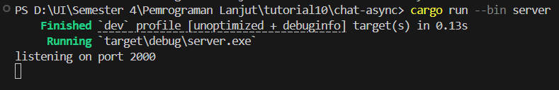

Client 1:

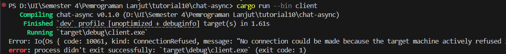

Client 2:

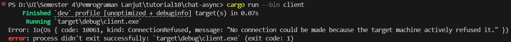

Client 3:

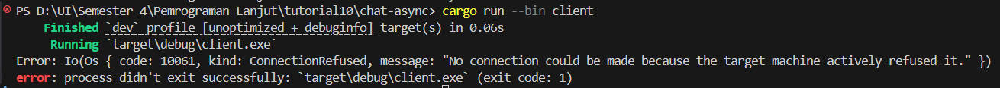

2nd Case:
In this case, I modified the port number in the `client.rs` file to `8080` and also changed the port number in the `server.rs` file to 8080.
Then, I ran the server with the command:

```bash
cargo run --bin server
```

After that, I ran the client with the command:

```bash
cargo run --bin client
```

The client will be able to connect to the server on port `8080` because both the client and server are running on the same port. This is because 
the client port and the server port must match in order for the client to connect to the server.

Result image:

Server:

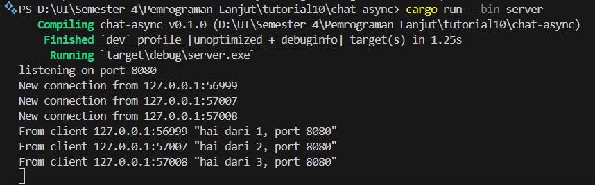

Client 1:

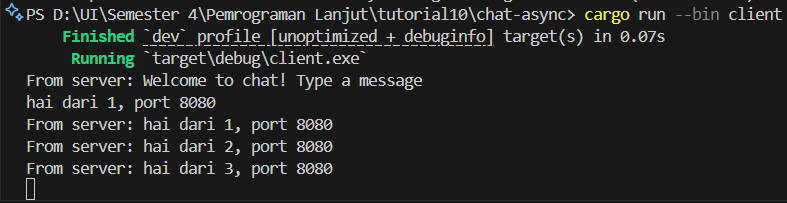

Client 2:

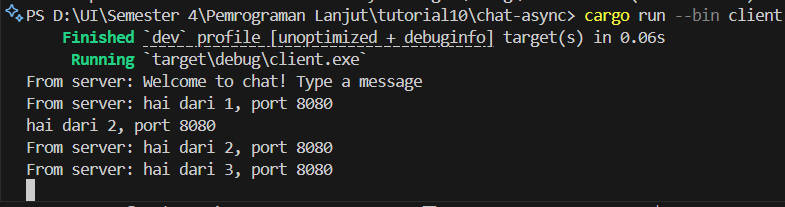

Client 3:

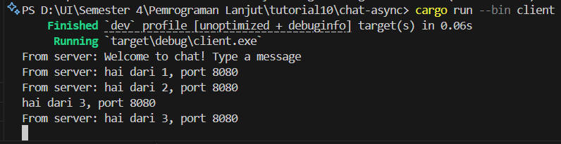

### Exercise 2.3
I enhanced the server's broadcast functionality by updating the handle_connection function to include client address information ({addr:?}) within 
the message format (bcast_tx.send(format!("{addr:?}: {text:?}"))?;). This modification attaches the sender's socket address details (IP and port 
combination) to each message, creating a built-in identification system that lets all participants see message origins.

This change allows clients to identify the source of each message, enhancing the chat experience by providing context and clarity.
it centralizes the formatting responsibility at the distribution point, ensuring all connected clients receive consistently formatted messages 
without needing to individually process raw message data. This approach preserves the architectural principle where the server acts as the central 
message coordinator, allowing client applications to remain streamlined with their focus on display rendering and user input processing.

Result image:

Server:

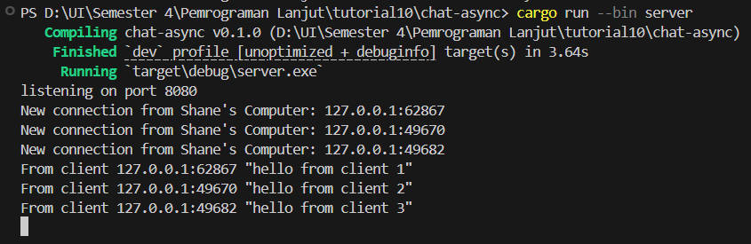

Client 1:

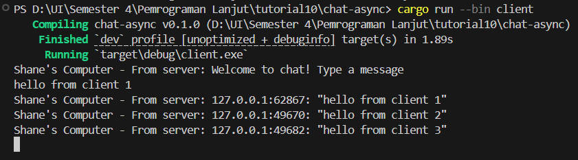

Client 2:

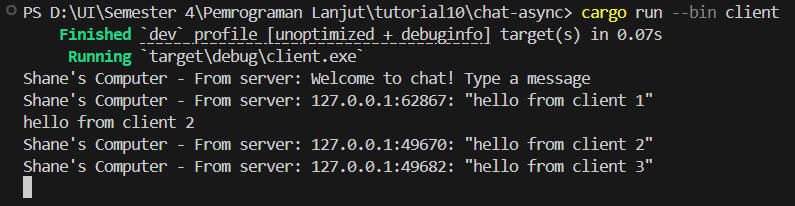

Client 3:

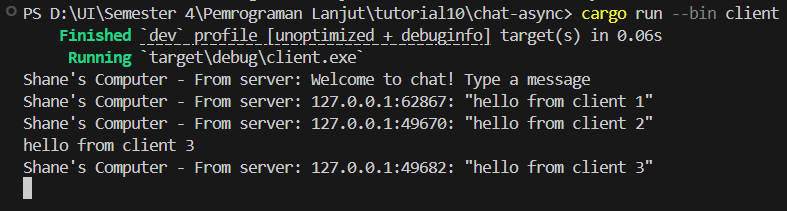