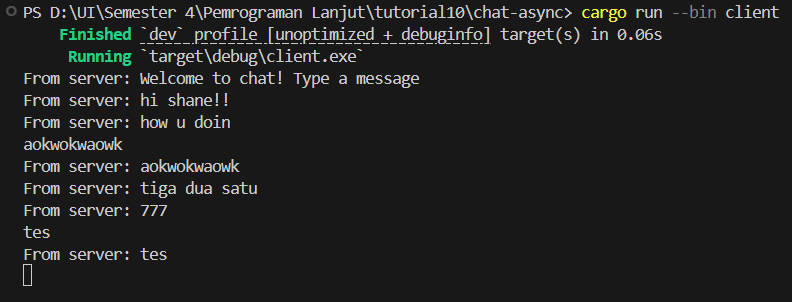

# Tutorial 10 Reflection
### Name: Shane Michael Tanata Tendy
### NPM: 2306259976
### Class: B

----

### Exercise 2.1
To run the code, I need to add several dependencies in the `Cargo.toml` file:

```toml
[dependencies]
futures-util = { version = "0.3.31", features = ["sink"] }
http = "1.3.1"
tokio = { version = "1.44.2", features = ["full"] }
tokio-websockets = { version = "0.11.4", features = ["client", "fastrand", "server", "sha1_smol"] }
```

After that, I need to run the client and server in separate terminals. In the first terminal, I run the server with the command:

```bash
cargo run --bin client
```
In the second terminal, I run the server with the command:

```bash
cargo run --bin server
```
By running the server and client in separate terminals, I can see the output of both 
the server and client. The server will print the messages it receives from the client, 
and the client will print the messages it receives from the server. With that, client
can see the messages sent by the server, and the server can see the messages sent by the client.

Result image:

Server:


Client 1:


Client 2:


Client 3:

